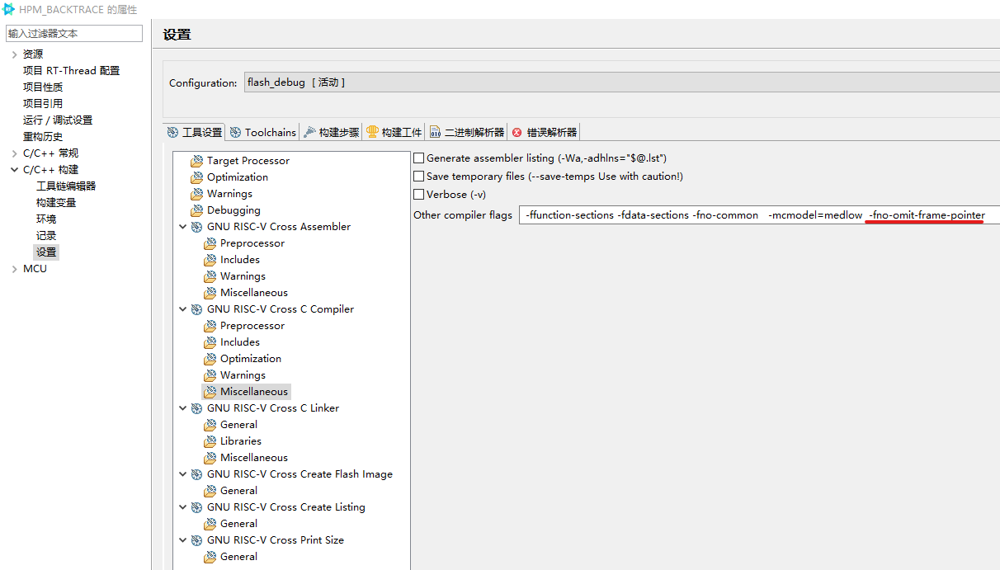

## 简介

RVBacktrace是一个极简的RISC-V栈回溯组件。用于断言或异常等情况下的辅助调试。

## API介绍

RVBacktrace组件仅包含一个面向用户的API，用户在需要的地方调用该函数可以进行从当前位置进行栈回溯，用户可将该API对接到断言函数或者在异常中调用，辅助调试。

```c
void rvbacktrace(void);
```

## 组件配置

组件支持两种方式栈回溯。

方式一：不添加编译参数，通过调用栈结构进行栈回溯。

优点：不额外占用系统寄存器  缺点：增加代码空间，效率较方式一较低

方式二：通过添加编译参数的方式，基于FP寄存器进行栈回溯。

优点：几乎不增加代码空间 缺点：占用s0寄存器，

## 使用方法

方式一：

默认使用方式一，首先确认链接脚本中存在下述符号

```c
extern char *__etext;
extern char *__stext;
```

若不存在，在连接脚本中添加，__ etext位于代码段的开始，__stext位于代码段的末尾，链接脚本中的示例添加位置：

```stylus
	PROVIDE (__stext = .);
    .text (__vector_load_addr__ + __vector_ram_end__ - __vector_ram_start__) : {
        . = ALIGN(8);
        *(.text)
        *(.text*)
        *(.rodata)
        *(.rodata*)
        *(.srodata)
        *(.srodata*)
        ...
            /* section information for usbh class */
        . = ALIGN(8);
        __usbh_class_info_start__ = .;
        KEEP(*(.usbh_class_info))
        __usbh_class_info_end__ = .;

    } > XPI0

    .rel : {
        KEEP(*(.rel*))
    } > XPI0

    PROVIDE (__etext = .);
```

在期望栈回溯的地方插入rvbacktrace函数，示例如下：

```stylus
void thread_entry(void *arg)
{
    rt_thread_mdelay(500);
    extern void rvbacktrace();
    rvbacktrace();
    while(1){
        app_led_write(0, APP_LED_ON);
        rt_thread_mdelay(500);
        app_led_write(0, APP_LED_OFF);
        rt_thread_mdelay(500);
    }
}
```

运行结果：

```stylus
---- RV_Backtrace Call Frame Start: ----
###Please consider the value of ra as accurate and the value of sp as only for reference###
------------------------------Thread: led_th backtrace------------------------------
[0]Stack interval :[0x000000000108f868 - 0x000000000108f878]  ra 0x000000008000cc6c pc 0x000000008000cc6a
[1]Stack interval :[0x000000000108f878 - 0x000000000108f888]  ra 0x000000008000cc6a pc 0x000000008000cc68
[2]Stack interval :[0x000000000108f888 - 0x000000000108f898]  ra 0x000000008000c92e pc 0x000000008000c92c
[3]Stack interval :[0x000000000108f898 - 0x000000000108f8a0]  ra 0x000000008001007e pc 0x000000008001007a
End of stack backtracking

addr2line -e rtthread.elf -a -f 8000cc6a 8000cc68 8000c92c 8001007a
---- RV_Backtrace Call Frame End:----
```

方式二：

首先在rvacktrace.h中定义BACKTRACE_USE_FP

```stylus
#define BACKTRACE_USE_FP
```

在C/C++以及汇编的编译选项下添加`-fno-omit-frame-pointer`编译参数，RT-Studio中的添加方式示例：



在期望栈回溯的地方插入rvbacktrace函数，示例如下：

```stylus
void thread_entry(void *arg)
{
    rt_thread_mdelay(500);
    extern void rvbacktrace();
    rvbacktrace();
    while(1){
        app_led_write(0, APP_LED_ON);
        rt_thread_mdelay(500);
        app_led_write(0, APP_LED_OFF);
        rt_thread_mdelay(500);
    }
}
```

运行结果：

```stylus
---- RV_Backtrace Call Frame Start: ----
###Please consider the value of ra as accurate and the value of sp as only for reference###
------------------------------Thread: led_th backtrace------------------------------
Current Thread Name:  led_th
[0]Stack interval :[0x0000000001090388 - 0x0000000001090398]  ra 0x000000008000d114 pc 0x000000008000d110
[1]Stack interval :[0x0000000001090398 - 0x00000000010903a8]  ra 0x000000008000cfba pc 0x000000008000cfb6
[2]Stack interval :[0x00000000010903a8 - 0x00000000010903b8]  ra 0x000000008001095a pc 0x0000000080010956
[3]Stack interval :[0x00000000010903b8 - 0x00000000deadbeef]  ra 0x0000000001086a7c pc 0x0000000001086a78

addr2line -e rtthread.elf -a -f 8000d110 8000cfb6 80010956 1086a78
---- RV_Backtrace Call Frame End:----
```

上述信息便是当前的栈回溯信息，除此之外组件输出addr2line工具支持的栈回溯命令，使用addr2line命令运行下述代码即可查看函数调用栈与函数符号。

```stylus
addr2line -e rtthread.elf -a -f 8000d110 8000cfb6 80010956 1086a78
```

方式二支持对当前系统所有的线程进行栈回溯，在rvacktrace.h中定义BACKTRACE_ALL

```stylus
#define BACKTRACE_ALL 
```

重新执行上述代码，运行结果：

```stylus
---- RV_Backtrace Call Frame Start: ----
###Please consider the value of ra as accurate and the value of sp as only for reference###
------------------------------Thread: led_th backtrace------------------------------
Current Thread Name:  led_th
[0]Stack interval :[0x0000000001090390 - 0x00000000010903a0]  ra 0x000000008000d26e pc 0x000000008000d26a
[1]Stack interval :[0x00000000010903a0 - 0x00000000010903b0]  ra 0x000000008000cfba pc 0x000000008000cfb6
[2]Stack interval :[0x00000000010903b0 - 0x00000000010903c0]  ra 0x0000000080010ac2 pc 0x0000000080010abe
[3]Stack interval :[0x00000000010903c0 - 0x00000000deadbeef]  ra 0x0000000001086a7c pc 0x0000000001086a78

addr2line -e rtthread.elf -a -f 8000d26a 8000cfb6 80010abe 1086a78

------------------------------Thread: tshell backtrace------------------------------
[1]Thread Name:  tshell
[0]Stack interval :[0x000000000108fea0 - 0x000000000108fed0]  ra 0x0000000001083f5c pc 0x0000000001083f58
[1]Stack interval :[0x000000000108fed0 - 0x000000000108fee0]  ra 0x0000000001084782 pc 0x000000000108477e
[2]Stack interval :[0x000000000108fee0 - 0x000000000108ff00]  ra 0x0000000080009d80 pc 0x0000000080009d7c
[3]Stack interval :[0x000000000108ff00 - 0x000000000108ff10]  ra 0x0000000080009eec pc 0x0000000080009ee8
[4]Stack interval :[0x000000000108ff10 - 0x00000000deadbeef]  ra 0x0000000001086a7c pc 0x0000000001086a78

addr2line -e rtthread.elf -a -f 1083f58 108477e 80009d7c 80009ee8 1086a78
------------------------------Thread: tidle0 backtrace------------------------------
[2]Thread Name:  tidle0
[0]Stack interval :[0x000000000108bf70 - 0x00000000deadbeef]  ra 0x0000000001086a7c pc 0x0000000001086a78

addr2line -e rtthread.elf -a -f 1086a78
------------------------------Thread: timer backtrace------------------------------
[3]Thread Name:  timer
[0]Stack interval :[0x000000000108c408 - 0x000000000108c428]  ra 0x0000000001088636 pc 0x0000000001088632
[1]Stack interval :[0x000000000108c428 - 0x00000000deadbeef]  ra 0x0000000001086a7c pc 0x0000000001086a78

addr2line -e rtthread.elf -a -f 1088632 1086a78
------------------------------Thread: main backtrace------------------------------
[4]Thread Name:  main
[0]Stack interval :[0x000000000108ebd8 - 0x000000000108ec08]  ra 0x0000000001086f68 pc 0x0000000001086f64
[1]Stack interval :[0x000000000108ec08 - 0x000000000108ec18]  ra 0x0000000001087096 pc 0x0000000001087092
[2]Stack interval :[0x000000000108ec18 - 0x000000000108ec28]  ra 0x0000000080010b84 pc 0x0000000080010b80
[3]Stack interval :[0x000000000108ec28 - 0x000000000108ec38]  ra 0x0000000080006890 pc 0x000000008000688c
[4]Stack interval :[0x000000000108ec38 - 0x00000000deadbeef]  ra 0x0000000001086a7c pc 0x0000000001086a78

addr2line -e rtthread.elf -a -f 1086f64 1087092 80010b80 8000688c 1086a78
Thread Total Num: 5
---- RV_Backtrace Call Frame End:----
```

该模式用于tshell线程可以正常执行时打印输出当前系统所有线程的调用栈，用于辅助分析死锁，线程异常挂起等现象

## 验证平台

|     芯片/内核     | 验证结果 |
| :---------------: | :------: |
|  D1/XuanTianC906  |   pass   |
| CH32V307/RISC-V4F |   pass   |
| HPM6750/Andes D45 |   pass   |

## 参考链接

上手说明：https://club.rt-thread.org/ask/article/64bfe06feb7b3e29.html
